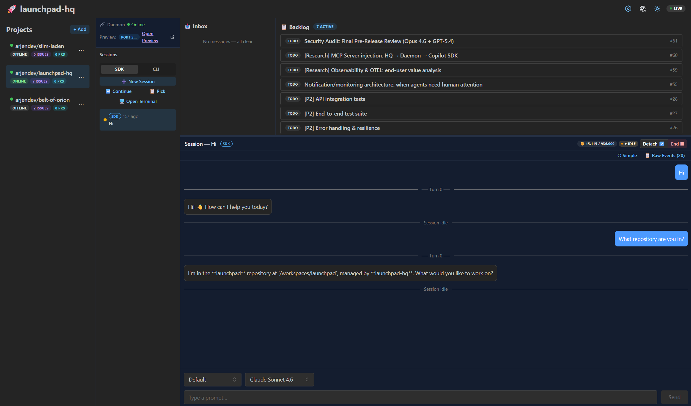

# 🚀 Launchpad HQ

> **Your AI-powered dev fleet Head Quarters.**

Track all your projects, every Copilot session, every tool call — from one dashboard.

Today it's about visibility, productivity and peace of mind. Tomorrow, we'll add Context Hub — where your context, skills and tools follow every agent safely, everywhere.



---

## Quick Start

```bash
npx launchpad-hq
```

Or install globally:
```bash
npm install -g launchpad-hq
launchpad-hq
```

> **Requirements:** Node.js 18+ and [GitHub CLI](https://cli.github.com/) authenticated (`gh auth login`)

Opens at `http://localhost:4321` — a three-pane mission control dashboard. Add your GitHub repos, see their issues on a kanban board, and watch Copilot sessions live as they work.

---

## Architecture

```
Browser ←ws→ HQ Server ←ws→ Daemon(s)
```

- **HQ Server** — Fastify backend serving a React dashboard. Aggregates state from all projects. Talks to GitHub's GraphQL API for issues/PRs.
- **Daemon (per project)** — Lightweight process running inside each project's devcontainer. Discovers Copilot sessions via `@github/copilot-sdk`, streams events, relays terminal I/O. Connects outbound to HQ over WebSocket.
- **WebSocket Protocol** — Dual-socket: `/ws` for browser clients (channel-based pub/sub), `/ws/daemon` for daemon connections (auth handshake + typed protocol).
- **React UI** — Mantine + TanStack Router/Query. Three-pane layout: project list → kanban board → live sessions. Light/dark theme.

---

## Current Features

- **Multi-project dashboard** — All your repos in one view with attention badges
- **Kanban boards** — GitHub Issues auto-classified into Todo / In Progress / Done
- **Live Copilot session introspection** — See conversations, tool calls, agent activity in real-time
- **Session steering** — Inject prompts or attach to a terminal and take the wheel
- **Daemon architecture** — Hub-and-spoke: one HQ, one daemon per project environment
- **Remote access** — Dev Tunnels integration with QR code for phone/tablet access
- **Terminal relay** — Full xterm.js terminal takeover via the daemon
- **Settings UI** — Configure state mode, Copilot preferences, models, and tunnels
- **Onboarding wizard** — Interactive CLI setup on first run
- **App preview proxy** — See running apps from the dashboard

---

## Roadmap / Vision

We're building toward a future where HQ doesn't just observe your AI fleet — it becomes your **Context Hub**.

- 🧠 **Context Hub** — MCP servers, custom instructions, shared skills — configured once in HQ, deployed to every agent automatically ([#59](https://github.com/arjendev/launchpad-hq/issues/59))
- 📊 **Token usage & observability** — Know where your AI spend goes across all projects ([#60](https://github.com/arjendev/launchpad-hq/issues/60))

For the full vision, see [VISION.md](./VISION.md).

---

## Built With


---

## Contributing

We develop this project openly using [`.squad/`](./.squad/) — our AI team's memory lives in the repo. PRs welcome.

This is a build-in-public project. Arjen is building the future of AI dev tooling with AI itself. If that sounds interesting, jump in.

---

## .squad/

This repo uses **Squad** for AI-assisted development. The `.squad/` directory contains team configuration, agent histories, and architectural decisions — it's how our AI team maintains context across sessions.

See [`.squad/team.md`](./.squad/team.md) for the team roster.

---

## License

MIT
